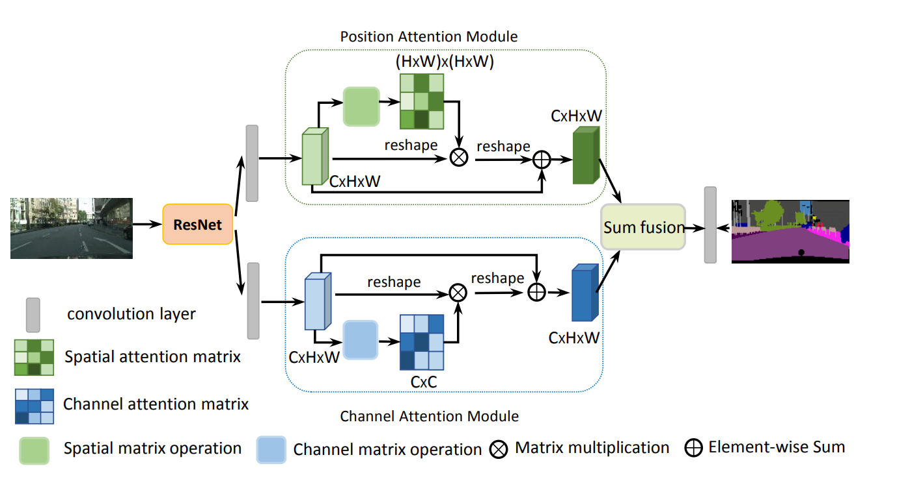
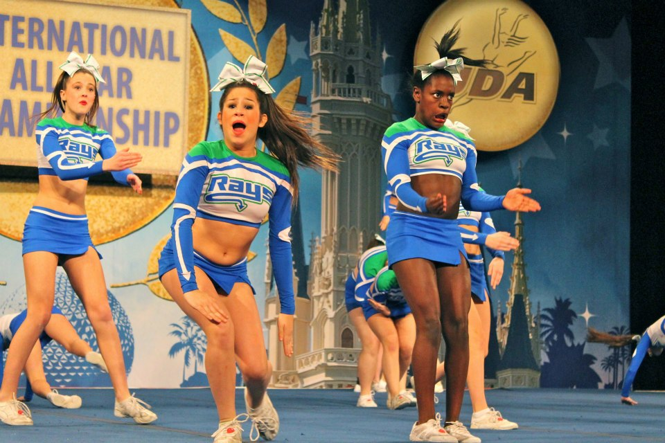
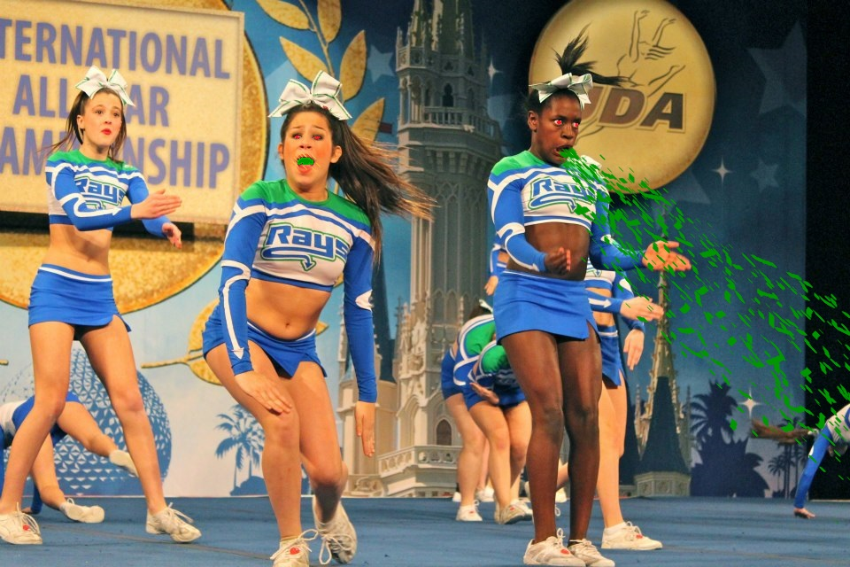
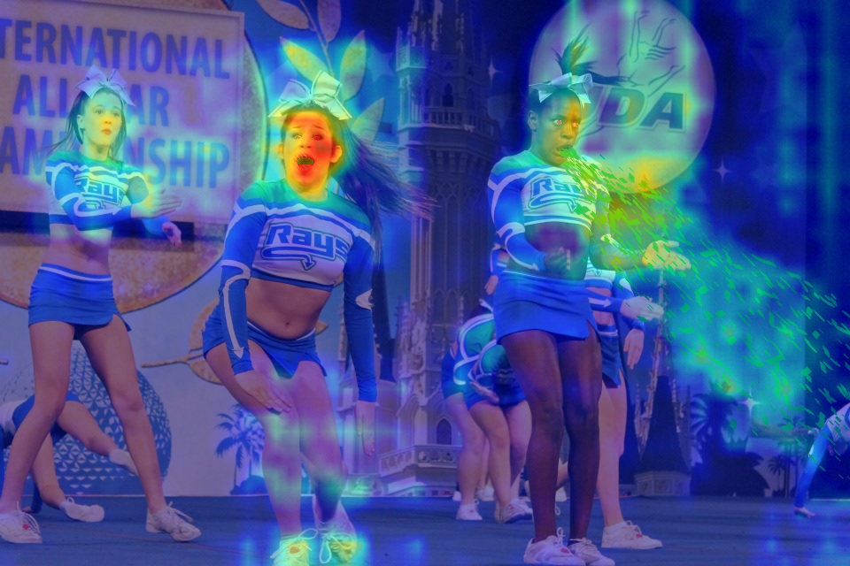

#  Image Manipulation Detection via Segmentation

用图像分割的视角进行图像篡改区域检测 (Multimedia课程大作业)


（DANet Architecture）
## Environment

+ Ubuntu 16.04.6 LTS （Windows is also fine）
+ Python 3.6
+ cuda10.1+cudnn7.6.3

## Requirement
+ Install [nvidia-apex](https://github.com/NVIDIA/apex) in this directory
+ pip install requirements.txt
+ Dataset : PS Battles
+ Forensics model zoo: MantraNet, **DANet**, Unet, FCN, Deeplabv3...

## Usage
将数据集文件夹ps_battles_orisize放到和train.sh同级目录下
### Test
```
bash run.sh
```

### Train
```
bash train.sh
```

请自行在./config的config文件中修改配置参数
将train_path,val_path,test_dir修改为自己的路径

# Visualization（Example）

For the trained DANet checkpoint, please contact me via E-mail.

Original Image:



Tampered Image (eyes, mouth and the vomit):



Visualization (with official implementation **Grad-CAM** on the backbone('resnet' block 4) output):


